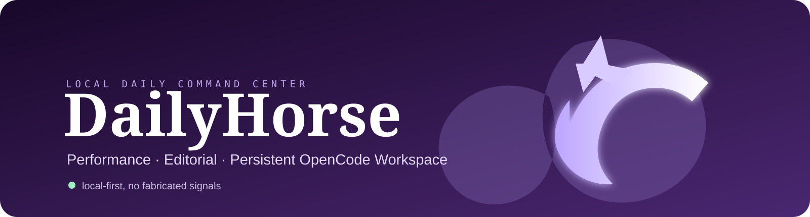

<p align="center">
  
</p>

# DailyHorse

**A local-first daily command center for performance, editorial work, and OpenCode-powered development.**

DailyHorse turns a browser new tab into a calm local workspace: check real performance signals, review editorial opportunities, open the full blog editorial desk, and delegate development work to persistent local OpenCode sessions.

> Local by design. No hosted control plane. No browser-cookie scraping. No fabricated metrics.

## What It Does

| Area | Purpose |
| --- | --- |
| **Command Center** | Persistent local OpenCode sessions, task queue, active jobs, recent activity, and an interactive terminal. |
| **Performance** | Official API-backed signals from GA4, Search Console, YouTube, GitHub, Google Play, and optional Meta/Instagram integrations. |
| **Editorial** | Blog inventory, ranked research candidates, editorial source health, and direct access to the existing local editorial desk. |
| **New Tab** | A minimal Chromium extension opens the local dashboard for every new browser tab. |

## Daily Flow

1. Open a new tab.
2. Capture a task with `OpenCode, erledige ...`.
3. See which agents and tasks are active, queued, stopped, or need attention.
4. Check measured performance and editorial signals.
5. Open the full local editorial workspace when it is time to research, draft, review, or publish.

## Architecture

```text
Chromium New Tab extension
          |
          v
DailyHorse dashboard  (127.0.0.1:4174)
          |
          +-- official analytics/content connectors
          +-- local editorial data and admin workspace
          +-- authenticated local WebSocket companion
                    |
                    +-- OpenCode PTY sessions
                    +-- interactive shell PTY
                    +-- SQLite task/session/event registry
```

The browser is a client only. The local Fastify service is the source of truth for agent metadata, queue state, and PTY lifecycle.

## OpenCode Command Center

- Multiple named local agent-session records with independent OpenCode PTYs.
- Persistent task queue and event history in local SQLite.
- Configurable concurrency cap through `OPENCODE_MAX_AGENTS` (default `3`, maximum `8`).
- Task states: `queued`, `starting`, `running`, `waiting`, `needs_attention`, `completed`, `failed`, `cancelled`.
- Companion restart reconciliation: previous running tasks become `needs_attention`; the dashboard never claims a process survived without verifying it.
- xterm.js shell and OpenCode terminals with ANSI colors, resize, scrollback, keyboard input, and copy/paste.

OpenCode itself remains responsible for its own permission model, `AGENTS.md` rules, configured providers, and operating-system access. DailyHorse does not auto-approve permissions or add privileges.

## Security Model

- The server binds to `127.0.0.1` by default.
- The workspace bridge accepts only explicit local dashboard origins.
- PTY control requires a short-lived, in-memory, same-origin token.
- No wildcard CORS, public network listener, remote-execution API, or command query parameters.
- OAuth credentials, service-account files, tokens, SQLite databases, logs, and `.env` are ignored by Git.
- External data comes from documented official APIs. When data is unavailable, the UI says so instead of estimating it.

## Requirements

- Node.js 22+
- Linux/macOS-style local shell for PTY support
- OpenCode installed and available on `PATH` for the agent workspace
- Optional: `systemd --user` for autostart
- Optional: provider credentials only for the connectors you choose to enable

## Quick Start

```bash
git clone https://github.com/Grenoullie91/DailyHorse.git
cd DailyHorse
cp .env.example .env
npm install
npm run build
npm start
```

Open `http://127.0.0.1:4174`.

For development:

```bash
npm run dev
```

## Configuration

All secrets are local environment variables. Start from `.env.example`; never commit `.env`.

| Setting | Use |
| --- | --- |
| `OPENCODE_WORKSPACE_DIR` | Neutral default directory for new OpenCode sessions. Defaults to the local home directory. |
| `OPENCODE_MAX_AGENTS` | Maximum concurrently spawned OpenCode agents. Defaults to `3`. |
| `SYNC_INTERVAL_MINUTES` | Connector refresh interval. Defaults to `60`. |
| `GITHUB_TOKEN`, Google/Meta settings | Optional connector credentials. They remain server-side only. |

## Browser New Tab

Load `new-tab-extension/` as an unpacked extension in a Chromium browser:

1. Open `chrome://extensions` or `brave://extensions`.
2. Enable **Developer mode**.
3. Select **Load unpacked**.
4. Choose `new-tab-extension/`.

The extension redirects new tabs to the local dashboard. It contains no credentials and does not communicate with external services.

## Autostart

The repository includes a user-service template for the dashboard. After building, install the user service:

```bash
npm run install-autostart
systemctl --user status haas-arts-dashboard.service
```

The editorial workspace is intentionally a separate local service in the Haas Arts installation because it owns the Markdown files and publication workflow.

## Honest Limitations

- OpenCode's terminal interface does not expose a universally reliable percentage-progress API. DailyHorse shows durable status, timestamps, output, and attention states instead of invented progress bars.
- Task completion and attention status can be set explicitly in the command-center lifecycle; process exits are reconciled conservatively.
- Connector coverage depends on external provider permissions. Unsupported metrics remain unavailable rather than inferred.

## Development

```bash
npm run build
npm test
```

The project uses React/Vite, Fastify, SQLite/WAL, xterm.js, node-pty, and official provider APIs. See `docs/research/` for connector-specific source and API notes.

## Privacy

DailyHorse is designed for a single local user. It is not a hosted multi-tenant service and should not be exposed to a network without a separate, deliberate security design.

## License

See [LICENSE](LICENSE).
